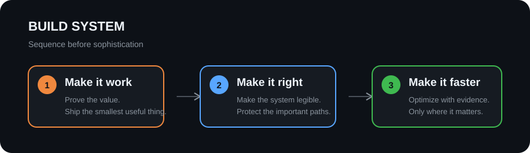

<h1 align="center">Kresna</h1>

  <strong>Founder · Automation Engineer · AI Lead @ MugenWorkLabs</strong>

  Building trustworthy automation and applied AI systems for real operational problems.

  <a href="https://github.com/SecretivePloter/absensi">QR Attendance System</a>
  ·
  <a href="https://github.com/SecretivePloter/SEIRI">SEIRI Scheduling</a>
  ·
  <a href="https://github.com/SecretivePloter/ihsg-fear-greed">IHSG Fear &amp; Greed</a>

---

### In brief

- **Founder, Automation Engineer &amp; AI Lead** at **MugenWorkLabs** — designing automation and AI-enabled systems that reduce operational friction.
- **B.Sc. Data Science student** — building stronger foundations in statistics, data systems, and decision-making.
- **Full-time trader** — applying structured research, disciplined risk management, and post-trade review to markets.

### Operating thesis

> Make the system legible. Automate the repetitive parts. Leave room for judgment.

I build systems that are useful in production: observable enough to inspect, simple enough to maintain, and deliberate enough to trust.

### Build system

> **Make it work. Make it right. Make it faster.**
>
> First prove the value, then make it dependable, then optimize with evidence.

### How I work

- **Evidence before theater** — measure what matters, document the assumptions, and make decisions traceable.
- **Correctness before speed** — ship the smallest useful solution, reinforce the critical paths, then optimize.
- **Ownership over handoffs** — stay close to the problem from first sketch through working software.
- **Calm under uncertainty** — use risk limits, feedback loops, and clear communication when information is incomplete.

### Selected work

| Project | What it does | Built with |
| :-- | :-- | :-- |
| [QR Attendance System](https://github.com/SecretivePloter/absensi) | QR-based attendance for a Japanese language institute: kiosk scanning, admin dashboards, attendance records, and Excel export. | React · Supabase · Tailwind · QR |
| [SEIRI Scheduling](https://github.com/SecretivePloter/SEIRI) | A single source of truth for Ichikara Sensei teaching schedules. | React · TypeScript · Supabase · Zustand |
| [IHSG Fear & Greed](https://github.com/SecretivePloter/ihsg-fear-greed) | A static market-sentiment dashboard for Indonesian equities, with scheduled data updates. | JavaScript · Python · GitHub Actions |

### Technical palette

`React` `TypeScript` `JavaScript` `Supabase` `Python` `GitHub Actions` `AI automation`

  Building in public, learning in public, shipping with intent.

